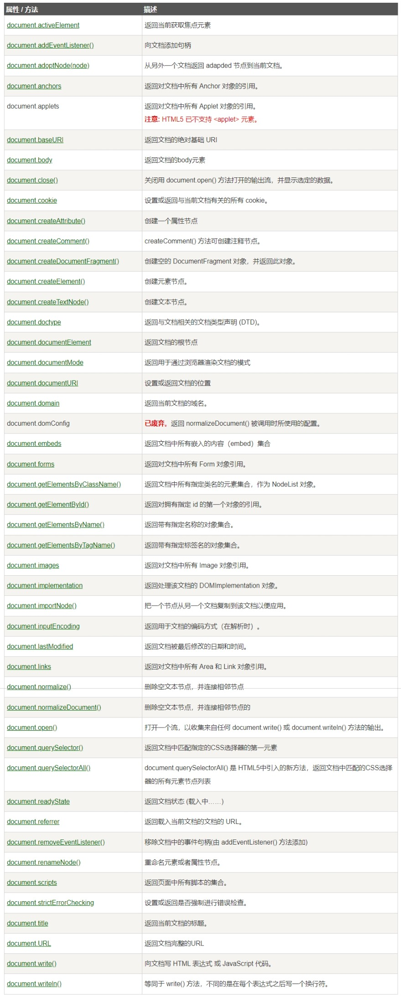

# 知识复习

## 一、盒子全居中的五个方法

基本框架

```HTML
  <div id="container">
    <span id="son"></span>
  </div>
```

###### 1.弹性布局

```CSS3
  <style>
    #container{
      width: 100vw;
      height: 100vh;
      display: flex;
      justify-content: center;
      align-items: center;
    }
    #son{
      width: 200px;
      height: 200px;
      background-color: red;
    }
  </style>
```

###### 2.宫格布局

```CSS3
  <style>
    #container{
      width: 100vw;
      height: 100vh;
      display: grid;/*只有这里换了下 */
      justify-content: center;
      align-items: center;
    }
    #son{
      width: 200px;
      height: 200px;
      background-color: red;
    }
  </style>
```

###### 3.宫格布局（复合属性）

```CSS3
  <style>
    #container{
      width: 100vw;
      height: 100vh;
      display: grid;
      place-items:center;/*把两行换成了复合属性 */
    }
    #son{
      width: 200px;
      height: 200px;
      background-color: red;
    }
  </style>
```

###### 4.CSS3偏移

```CSS3
  <style>
    #container{
      width: 100vw;
      height: 100vh;
    }
    #son{
      width: 200px;
      height: 200px;
      background-color: red;
      position: absolute;
      top: 50%;
      left: 50%;
      transform: translate(-50%,-50%);
    }
  </style>
```

###### 5.四边拉扯

```CSS3
  <style>
    #container{
      width: 100vw;
      height: 100vh;
    }
    #son{
      width: 200px;
      height: 200px;
      background-color: red;
      position: absolute;
      inset: 0;
      /* top: 0;
      bottom: 0;
      left: 0;
      right: 0; */
      margin: auto;
    }
  </style>
```


## 二、常见的布局方式有哪些？

###### 宫格布局（gird）

###### 弹性布局（flex）

###### 浮动布局（float)

###### 定位布局（position)

###### 表格布局（table)

# JavaScript知识复习

###### 1.什么是javascript？

​	js是一种轻量级的脚本语言，在程序中逐行解析，用来给HTML添加动态功能

###### 2.Javascript和Java有什么关系？

​	没有任何关系，js原名“*ECMAScript*”，名字中有"Java"字眼只是蹭了点热度

###### 3.Js的几种引入方式

- 内嵌（可放头部或尾部，推荐放尾部）
- 外联
- 行内

###### 4.Js的输出方式

- 控制台  (console.log)
- 文档输出（document.write)
- 警告框反馈（alert)
- 对话框弹出（prompt)

###### 5.数据类型有哪些？

基本数据类型

1. 数字（Number)
2. 字符串（String)
3. 布尔值（boolean)
4. 空（null）
5. 未定义（undefined)

引用数据类型

1. Array（数组）
2. Object（对象）
3. Symbol（唯一符号）

###### 6.数据转换

- 显示转换
  1. parseInt()：取整，把值转换为正整数
  2. parseFloat()：取浮点数，把值转换为浮点数
  3. String()：把值转换为字符串
  4. Number()：把值转换为数值类型
  5. Boolean()：把值转换为布尔类型（非0即为true）
- 隐式转换


**可以用typeof()判断数据类型**

###### 7.Javascript常用的选择器有哪些？

- getElementById('name')：获取ID名为”name“的元素
- getElementByClassName('name')：获取class名为”name“的元素
- getElementByTagName( ’ tagname‘ )：获取元素名为tagname的元素集合
- getElementName( ' abc' )：获取属性名为”abc“的元素
- querySelect( ’ ’ )： 返回选择匹配css选择器的第一个元素
- querySelectAll( ‘ ‘ )：返回选择匹配css选择器的所有元素

###### 8.事件权柄

- onclick	点击事件
- ondbclik    双击事件
- onmouseover   鼠标移入事件
- onmouseout    鼠标移出事件
- onmouseenter    鼠标进入事件
- onmouseleave    鼠标离开事件
- onkeydown    用户按下键盘按键

###### 9.获取元素内容

- innerHTML	获取元素内容（包含子集标签）
- innerText     获取元素文本
- value    获取表单内容

# 数学运算对象

###### 通用公式

- 某范围向下取整：Math.floor( Math.random( ) * ( b - a + 1) + a )
- 某范围向上取整：Math.ceil ( Math.random( ) * ( b - a ) + a )

###### 数组的扩展方法

- Array.of( )：把值转换成字符串
- Array.from( )：将字符串拆分为数组
- Array.find( function( ) )：找出数组中符合条件的第一个元素
- Array.findIndex( function( ) )：找出数组中符合条件的第一个元素的下标
- Array.fill( )：用指定的值填充到数组，并替换数组中的元素

###### 函数的四种形式

- 无参数，有返回值
- 无参数，无返回值
- 有参数，有返回值
- 有参数，无返回值

自定义函数，匿名函数，构造函数，箭头函数

###### 定时器

- setTimeout():延时器
- setInterval():定时器
- clearTimeout():清除延时器
- clearInterval():清楚定时器

###### Date（）对象

- getFullYear()：获取当前年
- getMonth()：获取当前月
- getDate()：获取当前日
- getHours()：获取当前时
- getMinutes()：获取当前分
- getSeconds()：获取当前秒
- getday()：获取当月第几周
- getMilliseconds()：获取当前毫秒

###### this的三种情况

1. 在函数体外，this指向windows
2. 在函数体内，this指向函数调用者
3. this更多的是用在对象中，this指向的是当前对象

###### 改变this的指向

- call（）	分别接受参数
- apply（）接受数组形式的参数
- bind（）

###### 自执行函数

1. 调用自执行	function app(){ 代码块 } app()
2. 括号自执行    (function () { 代码块 })（）
3. 符号自执行    +function(){ 代码块 }（）
4. 叹号自执行    ！function(){ 代码块 }（）

###### 什么是闭包

一个函数嵌套另一个函数，子函数可以访问父级函数的变量

*ps:尽可能闭包，因为会造成回调地狱（无限一直循环，造成内存浪费）*

# JS报错类型

原生错误类型

1. SyntaxEnrror：语法错误
2. ReferenceError：对象不存在
3. RangeError：范围超出
4. TypeError：变量或参数类型错误
5. URIError：函数或参数错误
6. EvalError：eval（）函数错误


# 作用域详解

##### 介绍说明

作用域就是指某个变量能够起到作用的范围区域，在js中对象和函数都可以是一个变量，所以变量可以分为**局部变量**和**全局变量**两种。

+ 局部变量：只能在函数内部访问
+ 全局变量：网页中所有脚本或函数均可访问

在ES2015（ES6)之前我们一般使用"var"关键字来定义变量或函数，而在ES6之后新增了"let"和"const"两个关键字。let声明的变量只在let命令行所在的代码块生效，const 声明一个只读的常量，一旦声明，常量的值就不能改变。

##### JS块级作用域

使用var声明的变量不具有块级作用域的特性，它在{}外依然能被访问到

```javascript
{
    var x = 2
}
//这里可以使用x变量
```

在 ES6 之前，是没有块级作用域的概念的。

ES6 可以使用 let 关键字来实现块级作用域。

##### let关键字

let 声明的变量只在 let 命令所在的代码块 **{}** 内有效，在 **{}** 之外不能访问。

```javascript
{ 
    let x = 2;
}
// 这里不能使用 x 变量
```

##### const关键字

const 用于声明一个或多个常量，声明时必须进行初始化，且初始化后值不可再修改：

```javascript
const PI = 3.141592653589793;
PI = 3.14;      // 报错
PI = PI + 10;   // 报错
```

##### 循环作用域

使用var关键字

```javascript
var i = 5;
for (var i = 0; i < 10; i++) {
    // 一些代码...
}
// 这里输出 i 为 10
```

使用let关键字

```javascript
var i = 5;
for (let i = 0; i < 10; i++) {
    // 一些代码...
}
// 这里输出 i 为 5
```

***注意：var声明的全局变量属于window对象，let声明的全局变量不属于window对象***

##### 变量提升

JavaScript 中，var 关键字定义的变量可以在使用后声明，也就是变量可以先使用再声明

var、let声明的变量都可以先使用后声明

```javascript
a = 1
b = 2
var a;
let b
```

const声明的常量同时必须初始化

```javascript
// 错误写法
const PI;
PI = 3.14159265359;

// 正确写法
const PI = 3.14159265359;
```

##### 总结

+ var关键字适用于全局变量
+ let关键字适用于局部变量
+ const关键字适用于常量

# DOM

此处图片搬自《菜鸟教程》



##### DOM简介

DOM (Document Object Model) 译为**文档对象模型**，是 HTML 和 XML 文档的编程接口。

HTML DOM 定义了**访问**和**操作** HTML 文档的标准方法。

DOM 以树结构表达 HTML 文档。

##### 节点（Node）

DOM的核心是将当中所有的内容作为对象处理，这些对象又被称作节点（node）


在各个节点之间的叫法与数据结构中的二叉树一般，有父级，子级，兄弟之称。

##### 节点类型

总共12中节点类型，也就是说html中的所有元素都算作一种类型

+ **Element**	      代表元素
+ **Text**       代表文本或属性中的文本
+ **Attr**     代表属性
+ **CDATASection**      代表文中的CDATA部分(不会有解析器解析文本)
+ **EntityRefrence**      代表实体
+ **Entity**        代表实体
+ **ProcessingInstruction**       代表处理指令
+ **Comment**        代表注释
+ **Document**       代表文档
+ **DocumentType**        代表文档类型
+ **DocumentFragment**      代表轻量级的DOCUMENT对象，能容纳文档中的某个部分
+ **Notation**      代表DTD种的声明符号

##### nodeType属性

节点属性nodeType可以用来判断节点

| 元素类型 | NodeType |
| :------: | :------: |
|   元素   |    1     |
|   属性   |    2     |
|   文本   |    3     |
|   注释   |    8     |
|   文档   |    9     |

##### 节点属性

|         属性名         |                         作用                         |
| :--------------------: | :--------------------------------------------------: |
|        nodeName        |                       节点名称                       |
|       childNodes       |            获取所有子节点 (包含文本节点)             |
|        children        |             获取所有子节点(不含文本节点)             |
|       firstChild       |               第一个子节点(含文本节点)               |
|   firstElementChild    |              第一个子节点(不含文本节点)              |
|       lastChild        |            获取最后一个子节点(含文本节点)            |
|    lastElementChild    |           获取最后一个子节点(不含文本节点)           |
|    PreviousSibling     |            获取上一个兄弟节点(含文本节点)            |
| PreviousElementSibling |           获取上一个兄弟节点(不含文本节点)           |
|       nextSibing       |            获取下一个兄弟节点(含文本节点)            |
|   nextElementSibling   |           获取下一个兄弟节点(不含文本节点)           |
|       parentNode       | 获取当前元素及其父级下所有的元素节点(通过子级找父级) |
|     parentElement      | 获取当前元素及其父级下所有的元素节点(通过子级找父级) |

+ parentNode是通用的获取父节点的属性，适用于所有节点类型
+ parentElement是专用于元素节点的属性，只能用于获取父元素节点
+ text 代表换行，换行、空格都算是节点

##### 节点方法

```javascript
var box = document.getElementById('box');
var ipt = document.getElementById('ipt');

//ID的获取与更改
console.log(box.id);//box
box.id = "page";
console.log(box.id);//page

//className 获取与更改
console.log(box.className);//list
box.className = "active"
console.log(box.className);//active
box.className = "active a b c d";
console.log(box.className);//active a b c d

//classList 类名列表
box.classList.add("e","f","h");//添加类名
console.log(box.className);//active a b c d e f h
box.classList.remove("a","b","c","d");//删除类名
console.log(box.className);//active e f h
console.log(box.classList.contains("active"));//true 检查类名是否存在
console.log(box.classList.contains("a"));//false
console.log(box.classList);//['active', 'e', 'f', 'h', value: 'active e f h']

// href 地址链接
var as = document.createElement("a");
as.href = "https://www.baidu.com";
as.innerHTML = "百度一下，你就知道又没有";
box.appendChild(as);
```

