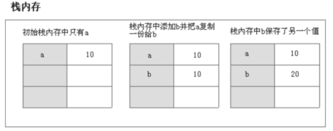
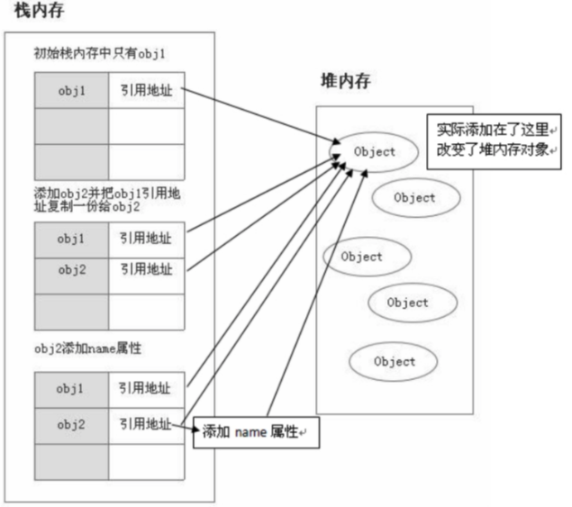

# 基本类型和引用类型的赋值区别

当我们把值赋值（=）给一个变量时，JavaScript解析器首先要做的就是确认这个变量是基本类型值还是引用类型。


在js包含两种不同的数据类型：

- 基本类型，按值传递，相当值复制一份给另外一个变量。修改新的变量不会影响旧的

- 引用类型，按址传递，值在传递的时候是传递内存中的堆地址给另外一个变量。修改新的变量会影响旧的


我们都知道变量是存储在内存中的,内存可以分为**栈内存**和**堆内存**

- 栈内存：主要存储基本类型的值和引用类型变量的地址。
- 堆内存：主要存储引用类型的值。如存放对象、数组、函数的值

## 基本数据类型的赋值过程（值传递）

先看下面一段代码：

```javascript
var a = 10;
var b = a; // b
b = 20;
console.log(b);	//  20
console.log(a);	//  10
```

解析：基本数据类型之间的赋值，都是把值复制一份赋值给另外一个变量，对原来的变量没有影响。

如下图是基本数据类型赋值的过程（值传递）：



## 引用数据类型赋值过程（址传递）

数组和对象都是引用数据类型，按**地址传递**，如下所示：

看下面一段代码：

```javascript
var arr1 = [2,3];
var arr2 = arr1; //相当于把arr1的堆 地址传给变量arr2
arr2.push(4); // 向数组arr2尾部添加一个元素
console.log(arr1); // [2,3,4]  可见，arr1也会受到影响
console.log(arr2); // [2,3,4]
```


解析:上面的值都是小锤，因为对象是引用类型，引用类型赋值的过程，是把变量的所在内存地址赋值给另外一个变量。于是多个变量都指向都一个内存空间，对其中一个变量进行更改，会影响原来的变量。


如下图是引用数据类型赋值的过程（按址传递）：




# 不同数据类型的比较

1. 基本类型比较是其值是否相等
2. 引用类型（数组、对象、函数）比较的是他们在堆中的内存地址是否一样，如果一样，说明他们是指向同一块堆内存

```javascript
		// 比较基本类型
        var a = 1;
        var b = 1;
        console.log(a === b); // true

		// 比较引用类型（数组）
        var arr1 = [1, 2, 3];
        var arr2 = [1, 2, 3];
		var arr3 = arr2
        console.log(arr1 === arr2); // false
		console.log(arr2 === arr3); // true
```


注意：函数也是一种引用类型，其类型是`function`，归属于对象的子类型。也是存在于堆内存中

```js
var foo = function(){}
console.log( typeof foo ); // 'function'

var bar = foo; // 也是引用传递
console.log(bar === foo); // true  说明堆内存空间一样，指向同一个引用
```


# 传递引用类型的参数

如果调用函数传递的是引用类型的参数，函数内部对其修改，会影响到原变量本身。因为传递的是引用（内存地址）。

```javascript
 function test(data) {
        data.push(4)
  }
var arr = [1, 2, 3]
// 传递引用类型，相当于把堆内存地址赋值给形参data了
test(arr)
console.log(arr); // [1,2,3,4]
```


