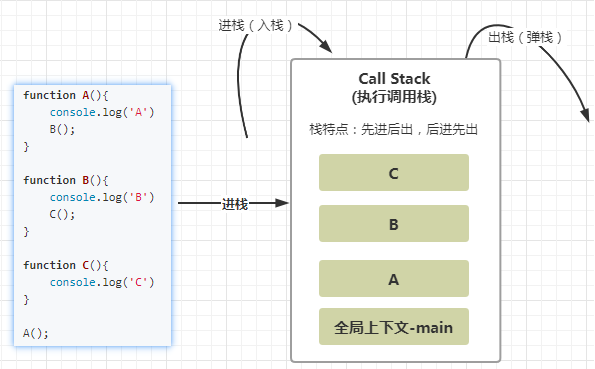
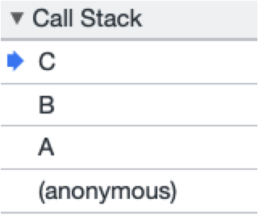

# 作用域

## 什么是作用域

作用域: 用来描述变量或函数有限的访问范围。

通俗一点就是某个变量或函数哪里可访问哪里不可访问。

**作用域分类：**

- 全局作用域: 非函数内的区域就是全局作用域（一般都是最外围）。
- 局部（函数）作用域: 即函数创建的作用域。


> es6还有块级作用域，后面再讲

```html
<script>
	// 全局作用域
	function hello(){
        // 局部作用域
	}
</script>
```


### 全局作用域（Global Scope）


-  在全局作用域定义的变量或函数我们称之为是全局变量或全局函数，在任何地方都可以被访问，包括函数。 

### 局部作用域（Local Scope）

- 在函数内部就是局部（函数）作用域
- 每调用一次函数就会创建一个新的函数作用域，它们之间是相互独立的。
- 函数内部声明的变量我们称之为**局部变量**，它只能在所定义的函数内部可访问，在全局中是无法访问的。


代码示例：

```html
<script>
    // 全局作用域
    var age = 18; // 全局变量
    var email = '123@qq.com' // 全局变量
    console.log(age); // 18

    function hello(){
      // 局部作用域
      var age = 20; // 局部变量 
      console.log(age); // 20
      console.log(email); // '123@qq.com'
    }
    hello();
</script>
```


## 作用域链（scope chain）

**作用域链**：即各个函数作用域链互相嵌套形成的一个链式结构。


这里要注意`作用域`和`作用域链`的区别

- 作用域:描述的是变量作用的范围。

- 作用域链:决定了变量的查找规则（就近原则，由内往外层找）。


示例代码：

```javascript
var age = '100';
function foo(){
    console.log(age); 	// ?
    function bar(){
        var age = '18'; 	
        console.log(age); 	// ?
        function par(){
        	console.log(age); 	// ?
        }
        par();
    }
    bar();
}
foo();
```

作用域链图解如下：


说明：

- 只有函数才可以形成作用域结构。如果没有函数那就只存在一个域，就是window全局作用域。

- 作用域链中查找变量的原则：**就近原则**。

  > 就近原则：访问变量，会优先在自身的作用域查找，若没有找到，会继续往上一级作用域中去找，直到找到全局作用域，若找到就使用，找不到就报错（引用错误，这个变量没有定义 xxxx not a defined）


# 函数形参就是函数的局部变量


记住：函数形参就是函数的局部变量

```js
var a = 1
var b = 2
function sum(a,b) {
    // 形参就是函数内部局部变量，如果要改形参的值，不需要在重复var声明
    var b = b + 1
    console.log(a + b) 
}

sum(3, 4) // 8
```


# 声明变量使用var和不使用var的区别

特别注意：声明一个变量若不加var关键字，则相当于声明了一个全局变量！！这种代码是不规范的，一定要避免，否则会对我们的程序造成潜在的bug，也不利于代码调试。

示例：

```javascript
var myname = "大锤";
function foo() {
    myname = "小锤" // 要避免
}
foo();
console.log(myname) // 小锤
```


# JS预解析

JavaScript代码的执行是由浏览器中的JavaScript引擎来执行的。执行时，分为两个阶段：`预解析`和`执行`。

先预解析，后执行


- **预解析阶段的工作：**

主要做提升

1. 把var声明的变量提升到当前作用域的最顶端。 
2. 把函数声明提升到当前作用域的最顶端。  

- **执行阶段的工作：**

1. 代码执行，如进行变量的赋值操作，和一些运算操作。

### 变量的提升

示例1：

```javascript
console.log(a); // undefined  
var a = 10;
```

由于var变量的提升，等价于：

```javascript
var a; // 提升到全局作用域最顶端
console.log(a); // undefined  
a = 10;
```

示例2：

```javascript
var age = 18;
function foo(){
	console.log(age);  // undefined
	var age = 19;
	console.log(age);   // 19
}
foo();
```

由于var变量会提升，等价于：

```javascript
var age = 18
function foo(){
    var age; // 提升到函数作用域最顶端
	console.log(age);  // undefined
	age = 19;
	console.log(age);   // 19
}
foo();
```

### 函数声明的提升

示例：

```javascript
foo(); // 1
function foo(){
	console.log(1); 	
}
```

由于函数声明会提升，等价于：

```javascript
function foo(){ // 提升到最顶端
	console.log(1); 	
}
foo(); // 1
```


### 提升优先级


注意：同名情况下，函数声明提升优先级要高于同名的变量声明。 

> 开发中是不会遇见的，但面试会！你懂的！

```javascript
var foo;
function foo(){
    console.log(2)
}
foo() // 2
```

由于提升：等价于

```js
// 先提升
function foo(){
    console.log(2)
}
// 后提升
var foo;

foo() // 2 优先会访问函数声明，函数是一等公民，
```


一句话总结：任何代码块内，只要使用了var声明的变量都会被提升到当前作用域最顶端。

所以不管是声明变量还是函数，养成先定义后使用的好习惯。提高代码的可读性


## 提升面试题

- 题1：

```javascript
var a = 100;
function test(){
    console.log(a);   // ?
    var a = 200;
}
test();
```

- 题2：

```javascript
var a = 100;
function test(){
    console.log(a);  // ?
    if(false){
        var a = 200;
    }
}
test();
```


# 断点调试

介绍：

- 断点调试可以让程序在某一行停止，然后可以逐行调试，调试过程中可以看各个变量当前的值。
- 多数用于分析某段js代码或一个js库（如：Vue库）的源代码是如何一步步执行的，这是采用断点调试就便于代码的追踪分析。

打断点的两种方式：

1. 代码中进行断点调试

```
debugger; // 打断点调试，代码执行这里，会直接停下。通过按钮逐步往下执行
```

2. 通过浏览器进行断点调试

浏览器中按`F12`-->`sources`-->找到需要调试的文件-->在程序的某一行点击设置断点

如下图步骤：


几个常用断点按钮说明：

、

第一个按钮：停止。

第二个按钮: 逐语句执行。但不会进入到函数内部。

第二个按钮: 逐语句执行。会进入到函数内部。


注意：

- js引擎是单线程：意味着同一时刻只能做一件事件。即js种只有一个call Stack(执行栈)
- 当分配的调用栈空间被占满时，会引发“堆栈溢出（RangeError: Maximum call stack size exceeded）”错误 

```js
function foo(){
	// debugger;
	foo(); // 递归调用,即自己调用自己 RangeError: Maximum call stack size exceeded
}

foo()
```


# 调用栈（Call Stack）

- 调用栈（Call Stack）是·追踪函数执行流程的一种机制。
- 作用：可分析代码的执行流程。

示例： 

函数A中调用函数B,函数B中调用了函数C。

```javascript
function A(){
    console.log('A')
    B();
}

function B(){
    console.log('B')
    C();
}

function C(){
    console.log('C')
}

A();
```

上述代码在执行调用栈中调用过程如下：




栈结构特点： 先进后出，后进先出。



1. 全局代码（script）首先产生一个全局执行上下文（全局环境)压入调用栈的底部
2. 每调用一个函数，该函数就会压入到调用栈的顶部
3. 当某个函数执行完毕之后，此函数就会出栈。其函数内部的局部变量都会被销毁。
4. 当所有的函数执行完毕之后，只剩下全局上下文了。
5. 全局上下文只有用户关闭浏览器才会被释放

可进行打断点调试，便可以看到浏览器中调用栈记录：


注意：

- 只有函数才会产生局部作用域
- 函数调用完毕后会出栈，内部的局部变量也会随之销毁，所以全局内无法访问局部变量。

