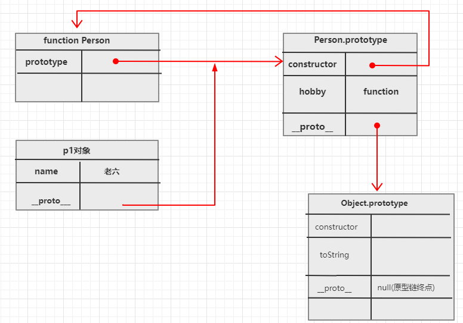

# 什么是对象

现实生活中：万物皆对象，对象是一个具体的事物，一个具体的事物就会有特征和行为。


**如：一辆车，一个人，一只狗他们都是对象！！**

车的属性： 颜色、重量。 
行为有：启动、刹车、前进、后退。

人的属性： 身高、年龄、体重、姓名。 
行为有： 说话、跑步、跳跃、打架、打游戏。

狗的属性：颜色、名字。 
行为有：摇尾巴、汪汪叫等 

在编程的世界中，特征叫做属性，行为叫做方法

## 为什么需要对象
如果使用基本数据类型的数据，我们所创建的变量都是独立的，值和值之间没有任何的关联，不能成为一个整体。

而对象是属于一种复合的数据类型，在对象中可以保存多个不同类型的数据。

这就是对象存在的意义。

如，用JS来表示一个人的信息
```js
var name = "大锤";
var sex = "男";
var age = 28;
```
上面的变量都是独立的，没有任何关联，不能成为一个整体。

## JS对象分类

1. 内建(内置)对象
   - 由ES标准中定义的对象，任何JS引擎实现此标准的都可以使用
   - 比如： String、Number、Math、Boolean、Function、Object。
2. 宿主对象
   - 有JS所在运行环境提供的对象，如浏览器环境
   - 比如： DOM、BOM对象
3. 自定义对象
   - 开发人员自己创建的对象
# 创建对象的多种方式

## 通过Object构造函数创建对象

有两种形式：

- 字面量形式【推荐】
- 构造函数形式 

示例：


```javascript
// 字面量创建对象本质是new Object简写形式。也称之为是语法糖形式。
var obj1 = {
    name: "宁宁",
    age: "20",
    hobby: function () {
        console.log(this.name + '爱好是打球')
    }
}

obj1.hobby()

// 方式2：通过内置Object构造函数（构造器）
var obj2 = new Object()
obj2.name = '慧慧'
obj2.age = '23'
obj2.hobby = function () {
    console.log(this.name + '爱好是拉小提琴')
}

obj2.hobby()

// instanceOf：用来判断一个对象是否是某个构造函数的实例对象
console.log(obj1 instanceof Object)// true
console.log(obj2 instanceof Object)// true
```


上面两种方式创建对象带来的缺点：如果要创建大量的对象，会设置很多重复的属性。导致代码冗余。


解决办法：通过工厂方式来创建对象。


## 通过工厂方式创建对象
工厂顾名思义就是加工产品的地方，在这里我们需要工厂帮助我们创建一个对象。

通过工厂方式创建对象核心思想：创建一个函数，调用函数时传递对象所需要的属性值，最终把对象返回即可。

```javascript
// 创建一个工厂（函数），返回对象
function createObj(name,age){
  var obj = new Object();
  obj.name = name;
  obj.age = age;
  return obj;
}

var obj1 = createObj('大锤',38)
var obj2 = createObj('小锤',18)
```


### 工厂方式创建对象的缺点

上面创建对象的类型比较单一，也就是只能创建`Object`类型的对象。

但是我想创建人类型的对象、车类型的对象，js就没有办法实现了。

幸运的是，在js中可以通过自定义构造函数（构造器）形式来创建指定类型的对象。


## 通过自定义构造函数创建对象


### 什么构造函数（构造器）

就是把对象一些相同的属性和方法抽象出来封装到函数中，再通过new此函数来创建对象。

此函数就称之为是构造函数。


构造函数作用：可以创建指定类型对象。如猫类型、狗类型。。。


分类：

- 内置构造函数（String、Number,  Boolean、Function、Array、Error、RegExp、Object）
- 自定义构造函数：程序员自己定义的。可以创建指定类型对象。


如下创建一个Person构造函数

```javascript
        // 自定义Person类型的构造函数，可以创建人的类型
        // Person就是构造函数的名字，约定好首字母大写
        function Person(name, age) {
            // console.log(this); // 指向我们创建的对象
            // 通过this给创建的对象初始化属性值和方法
            this.name = name
            this.age = age
            this.hobby = function () {
                console.log(this.name + '哇哇哭')
            }

            // return this; // 最终会隐式将this对象返回给外部调用者
        }

        // 通过 new 构造函数() 创建出来的对象，我们称之为是实例对象
        var p = new Person('宁宁', 20)
        p.hobby();
        var p2 = new Person('慧慧', 23)
        console.log(p2.age); // 23 


        // 判断对象p 是否是 Person构造函数的实例
        console.log(p instanceof Person) // true
        console.log(p2 instanceof Person) // true

```

注意：

1. 构造函数首字母一般约定大写。
1. 构造函数要和new一起使用才有意义。
1. new 构造函数时，内部会隐式返回this关键字


### new 到底干了什么

我们知道通过new关键字可以创建一个对象。

其在new 的时候，主要做了以下3件事情

1. 执行构造函数中的代码
1. 构造函数会在堆内存中创建一个对象，并用this指向它，在此函数中，可以给this进行初始化设置。
1. 最终构造函数隐式返回this给调用者


### 构造函数中的 return

1. 如果没有返回值，则会自动把this隐式的返回给外部调用者
1. 如果是返回其他对象，那么返回者就是此对象
1. 如果返回的是基本（原始）类型，则返回的值依然是this


换句话说，带有对象的 return 返回该对象，在所有其他情况下返回 this。

```javascript
// 模拟一个类（创建一个构造函数（构造器））
// Person就是类名，（首字母大写）
function Person(name,age){
  this.name = name
  this.age = age
  this.run = function(){
    // this指向当前调用者。
    return this.name +'在跑步'
  }
  
  // 会自动把this隐式的返回给外部调用者
  // return this; // 默认会显示返回  一般不需要写返回值，会默认返回当前对象this
  // return {a:2} // 返回 {a:2}
  // return 123; // 若原始类型，则还是返回this
}
```

### this关键字详解

现在我们需要掌握函数内部的this几个特点
	1. 函数在定义的时候this指向是不确定的，不能看它定义的位置，要看this所在的执行环境。
	2. 一般函数直接执行，内部this指向全局window
	3. 函数作为一个对象的方法，被该对象所调用，那么this指向的是该对象

总结一句话，this永远指向最后的调用者，若没有调用者一般都是指向全局对象window


# 函数对象和实例对象


- 实例对象：通过 new 构造函数产生的对象称为实例对象。
- 函数对象：将函数作为对象使用时，称为函数对象。

示例：

```js
function Person(){}
var p = new Person(); // 实例对象

function foo(){}
foo.call() // 函数对象
```


# 避免构造函数当做普通函数调用

- 当普通函数来调用this指向window
- 当构造函数来调用this指向当前创建的对象

```javascript
function Person(){
  console.log(this); // 普通调用this指向window, new调用指向当前创建的对象
}

Person(); // 当普通函数使用
new Person(); // 当构造函数使用
```


假设我们定义了一个构造函数，限制只能new来调用，那么，如何防止用户直接当做普通函数来调用呢？

解决办法：用 instanceOf 关键字。

因为一个对象如果是通过构造函数创建出来的，那么这个对象一定是构造函数的实例，通过instanceOf 来判断即可。

```javascript
      function Person(){
        if(this instanceof Person){
            console.log('构造函数调用');
        }else {
            console.log('普通函数调用');
        }
      }

      Person(); // 普通调用

      new Person(); // 构造函数调用
```

如果用户不是new操作，我们应该怎么？

```javascript
 // 需求：如果用户不是new操作，我们应该怎么办?
// 1. 提示用户必须new操作
// 2. 手动帮他new操作
function Person(name, age) {
    if (!(this instanceof Person)) {
        // 说明不是new操作,给用户一个警告
        console.warn('Person is a constructor and should be called with the `new` keyword')
        // 实现帮用户new操作
        return new Person(name, age)
    }
    this.name = name
    this.age = age;
}

var p = Person('宁宁', 20)
console.log(p);
```


# 原型对象

## 为什么要学习原型对象

先来看下一下代码：

```javascript
    function Person(name){
        this.name = name
        this.hobby = function(){
            console.log('开二手法拉利');
        }
    }

    var p1 = new Person('老六')
    var p2 = new Person('老王')
    
    // 对于对象、数组、函数名的比较，都是比较他们在堆中的内存地址
    console.log( p1.hobby === p2.hobby ); // false ， 说明占用不同的堆内存
```

上面的值为false。 由此可知，仅通过构造函数创建的对象会浪费内存空间。

原因是每个对象都是在自身（this）的内存空间中单独存储一个公有方法hobby，我们应该让这些公有的方法让每个对象共享。

我们目标是希望把这些公共的方法或属性抽离出来，从而节省内存空间。

内存图解：


解决办法： 借助原型对象。


## 什么是原型对象

三个特点（务必记住）：

- 每个构造函数都会有一个`prototype`属性，其值是一个对象,此对象就是原型对象。一般称之为是显示原型
- 通过构造函数`new`出来的实例对象，其身上会有一个`__proto__`属性，其值也是原型对象。一般称之为是隐式原型
- 原型对象会有个`constructor`属性，指向构造函数本身

```javascript
function Person(name){
  this.name = name
}

Person.prototype.hobby = function hobby(){
  console.log('都爱打麻将');
}

var p1 = new Person('老六')
var p2 = new Person('老王')
console.log( p1.hobby === p2.hobby ); // true, 共享同一块内存 

console.log(Person.prototype === p1.__proto__); // true ,指向同一个原型对象
```

内存图解：


可见，原型对象优点：

- 抽离对象的公有属性或方法，解决内存空间浪费问题。
- 用于对象的继承，实现代码的复用。


## 对象访问属性的原则

- 对象访问属性或方法的规则：就近原则。
- 会优先在对象自身空间中找，若找不到，则通过对象`__proto__`找到其对应的原型对象。

```js
// 构造函数(器)Person
function Person(name, age) {
    this.name = name;
    this.hobby = function () {
    	console.log('自身空间hobby:', this.name + '开法拉利')
	}
}

Person.prototype.hobby = function () {
	console.log('原型hobby:', this.name + '开法拉利')
}

var p1 = new Person('宁宁')
p1.hobby()
       
```


## 基础原型链

- 原型对象本身也有自己的原型
- 原型链：就是实例对象和各个原型对象形成的一个链式结构。
- 构造函数的prototype属性指向其原型对象，原型对象也会有个`__proto__`属性，指向Object.prototype原型。
- Object.prototype对象同样也有个`__proto__`属性，其值为null,此时就是原型链的终点。

```javascript
 
		function Person(name) {
            this.name = name
            // this.sayHello = function () {
            //     console.log("对象自己的hello")
            // }
        }

        // 去Person原型中添加一个hobby方法
        Person.prototype.hobby = function () {
            console.log(this.name + '的爱好')
        }

        // Person.prototype.sayHello = function () {
        //     console.log("person的hello")
        // }

        // Object是js内置构造函数（超类、基类），后面任何对象，都要继承Object.prototype。
        Object.prototype.sayHello = function () {
            console.log("Object的hello")
        }

        console.log(Person.prototype.__proto__ === Object.prototype) // true

        // 创建一个实例对象
        var p1 = new Person('老六')
        console.log(p1);
        p1.sayHello()

        // 对象方法在原型链中找不到最终则报错，属性最终找不到会返回undefined
        // p1.sayHi()// 报错
        // console.log(p1.aaaaa) // undefined

        console.log(Object.prototype.__proto__) // null 到了原型链顶端
```

内存图解如下：




