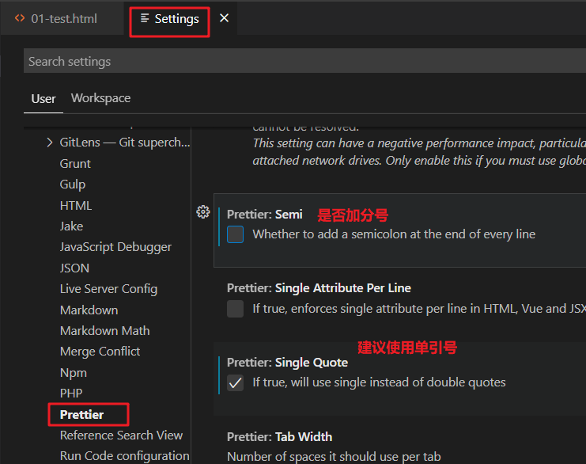
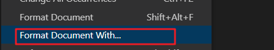
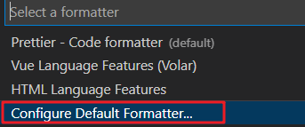

# 美化格式化代码

1. vscode中装插件 Prettier - Code formatter

2. 配置插件

   

3. 更改默认格式化工具：

   第一步：鼠标右键：选择 Format Documet With选项，

   

   第二部步：选择configure设置默认格式化工具，找到所安装的Prettier选项，按回车确认

   

   选择prettier选项，回车即可。

4. 保存自动格式化

   步骤： settings -> Text Editor -> Formatting,勾选Format On Save选项

   

